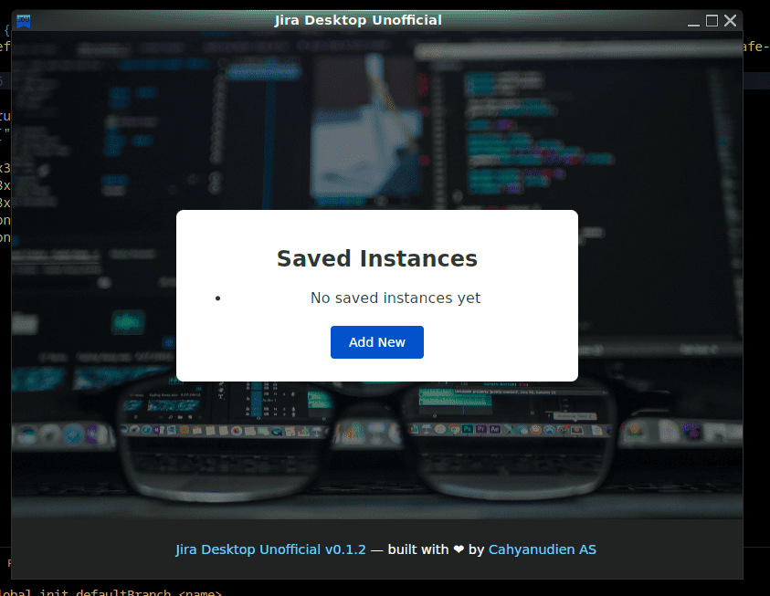

# Jira Desktop Unofficial

A minimal Jira desktop wrapper built with [Tauri](https://tauri.app/) — Reclaim your focus with a distraction-free Jira experience.

## 🖥️ What Is It?

Jira Desktop Unofficial is a clean, focused desktop wrapper for Jira. No tabs. No distractions. Just Jira in its own window — fast, secure, and memory-efficient.

Think of it as giving Jira its own dedicated workspace on your desktop, similar to how Slack, Discord, or VS Code operate as standalone applications, but without the resource overhead of traditional Electron apps.

## ✨ Features

- 🖥️ **Dedicated Window** — Opens your Jira instance in a clean, focused desktop window
- ⚡ **Ultra-lightweight** — Fast startup and low resource usage (thanks to Tauri + Rust)
- 🔒 **Privacy-focused** — No tracking, no telemetry, no data collection
- 🌐 **Universal compatibility** — Works with Jira Cloud, Server, and Data Center instances
- 🧠 **Smart memory** — Remembers your Jira URL and window preferences
- 🎨 **Native feel** — Integrates seamlessly with your operating system
- 📱 **Multi-platform** — Available for Windows, macOS, and Linux

## 🚀 Getting Started

1. **Download** the latest release from the [GitHub releases page](https://github.com/cas8398/jira-desktop-unofficial/releases)
2. **Install** the app for your operating system
3. **Launch** and enter your Jira instance URL (e.g., `https://company.atlassian.net`)
4. **Focus** — Enjoy your distraction-free Jira experience! 🎯

### Supported Jira Instances

- Jira Cloud (`*.atlassian.net`)
- Jira Server (self-hosted)
- Jira Data Center

## 🧩 Why Not Electron?

When building this project, I chose Tauri over Electron for compelling reasons:

### The Electron Problem
- **Memory hungry** — Often consumes 300–500MB+ of RAM
- **Large downloads** — App bundles frequently exceed 100MB
- **Security concerns** — Full Node.js runtime in the frontend
- **Performance overhead** — Chromium engine for every app

### The Tauri Advantage
- **Efficient memory usage** — Typically under 50–100MB
- **Smaller binaries** — Downloads under 10MB
- **Better security** — Isolated Rust backend with minimal frontend permissions
- **Native performance** — Uses your system's webview instead of bundling Chromium
- **Modern architecture** — Built for the future of desktop apps

## 📈 Performance Comparison

| Metric         | Jira Desktop Unofficial | Typical Electron App | Browser Tab            |
| -------------- | ----------------------- | -------------------- | ---------------------- |
| Memory Usage   | ~80MB                   | ~350MB               | ~150MB                 |
| Startup Time   | <2 seconds              | 5-8 seconds          | Instant                |
| Download Size  | ~8MB                    | ~120MB               | N/A                    |
| Background CPU | Minimal                 | Moderate             | High (with other tabs) |

## 🎯 Who Is This For?

If you're a developer, project manager, or anyone who:

- Spends significant time in Jira daily
- Values focus and minimalism in their tools
- Wants to reduce browser tab chaos
- Appreciates lightweight, efficient software
- Prefers open-source solutions

…then Jira Desktop Unofficial might be exactly what you need.

## 🔮 What's Next?

I'm actively working on several enhancements:

- **Notification management** — Desktop notifications for Jira updates
- **Keyboard shortcuts** — Quick actions without touching the mouse
- **Theme customization** — Dark mode and custom styling options
- **Multiple instances** — Support for users with multiple Jira accounts
- **Offline indicators** — Visual feedback for connection status

## 🤝 Community & Feedback

This project is open source and community-driven. Whether you're a developer who wants to contribute code, a designer with UI/UX suggestions, or a user with feature requests — I'd love to hear from you!

- **Found a bug?** Please [open an issue](https://github.com/cas8398/jira-desktop-unofficial/issues) with details about your setup and what happened
- **Have an idea?** Start a discussion in the [GitHub Discussions](https://github.com/cas8398/jira-desktop-unofficial/discussions) section
- **Want to contribute?** Check out the contributing guidelines and open a pull request

## 📦 Download

➡️ **[Download the latest release](https://github.com/cas8398/jira-desktop-unofficial/releases)** for Windows, macOS, or Linux

⭐ **Star the project** if you find it useful

## 🙏 Acknowledgments

Built with love using the amazing [Tauri framework](https://tauri.app/). Special thanks to the Tauri team for creating such an elegant solution for cross-platform desktop apps, and to the Jira community for the inspiration and feedback.

---

**Questions or feedback?** Feel free to reach out through GitHub issues or discussions!
